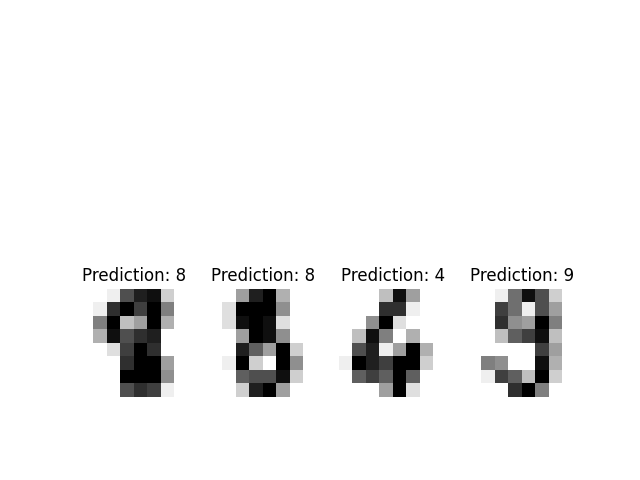

# Digit Recognizer
Digit Recognizer using SVM.

> Created in 2018 September.

## Dataset
In this project we use sklearn dataset module to load digits.

## Model
We use SVM classifier in sklearn to recognize the digits.

## Install
Type <code>pip install -r requirements.txt</code> to install necessary modules.

## Result

